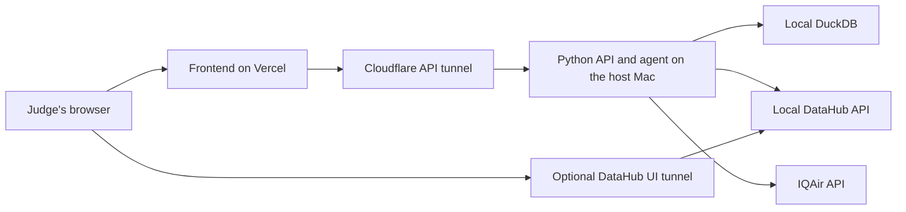

# AirTrace demo deployment

This document explains how to run the public hackathon demo without DataHub
Cloud. The frontend is deployed to Vercel. The Python API, DuckDB, and
open-source DataHub run on a teammate's Mac and are temporarily exposed through
Cloudflare Tunnel.

This is a **demo strategy**, not a production architecture. It works only while
the host Mac is awake, online, and running every required process.

## Architecture



## What runs where

| Component | Location | Purpose |
|---|---|---|
| Frontend | Vercel | Gives judges a stable public application URL. |
| Python API and agent | Host Mac, port 8000 | Reads data, calls DataHub, and creates reports. |
| DuckDB | Host Mac | Stores the demo observations and recommendations. |
| DataHub Core | Docker on the host Mac | Supplies schema, freshness, ownership, and lineage context. |
| Cloudflare Tunnel | Host Mac | Gives local HTTP services temporary public HTTPS URLs. |

The frontend never connects directly to DuckDB or DataHub. It calls the Python
API, and the Python API contacts both local services.

## What works today

- IQAir collection saves Hanoi observations to DuckDB.
- DataHub can ingest the DuckDB table metadata.
- The Python API returns recent DuckDB observations.
- The frontend displays those observations.

## Still to be implemented

- The AI agent and prompt box.
- DataHub queries performed by the agent.
- The deterministic alert-recommendation rule.
- Storage for generated reports and alert recommendations.
- The deployed Vercel frontend configuration.
- Production CORS settings for the Vercel URL.

Keeping this list explicit prevents the current dashboard prototype from being
mistaken for the completed agent.

## One-time preparation

### 1. Install project dependencies

From the main project folder:

```bash
uv sync
```

For the frontend:

```bash
cd frontend
npm install
cd ..
```

### 2. Prepare the IQAir secret

Copy the example environment file if `.env` does not already exist:

```bash
cp .env.example .env
```

Add the IQAir API key to `.env`. Never commit `.env`.

### 3. Install Cloudflare Tunnel

On macOS with Homebrew:

```bash
brew install cloudflared
```

Cloudflare Quick Tunnels create random public URLs and are intended for testing
and development. A new URL is normally created whenever a quick tunnel is
restarted.

## Start the demo

Start the following processes in order. Keep each long-running process in its
own terminal window.

### Terminal 1: start DataHub

```bash
uv run datahub docker quickstart
```

The normal local addresses are:

```text
DataHub UI:  http://localhost:9002
DataHub API: http://localhost:8080
```

Confirm the UI loads before continuing. If DataHub prints different ports, use
the printed values instead.

### Terminal 2: collect an observation

This command makes one IQAir request and then finishes:

```bash
uv run python main.py
```

Inspect the saved data if needed:

```bash
uv run python scripts/inspect_database.py
```

### Terminal 3: publish metadata to DataHub

```bash
uv run datahub ingest -c ingestion/duckdb.yml
```

This republishes table metadata. It does not need to run for every new row
because DataHub catalogs metadata rather than serving the observation rows.

### Terminal 4: start the Python API

```bash
uv run uvicorn api:app --reload --port 8000
```

Test it locally:

```text
http://localhost:8000/api/health
http://localhost:8000/api/observations
```

### Terminal 5: expose the Python API

```bash
cloudflared tunnel --url http://localhost:8000
```

Copy the generated HTTPS address. It will resemble:

```text
https://random-api-name.trycloudflare.com
```

This is the public API address the Vercel frontend must use.

### Terminal 6: optionally expose the DataHub UI

Use this when judges should inspect the DataHub catalog directly:

```bash
cloudflared tunnel --url http://localhost:9002
```

Copy the second generated HTTPS address and include it in the judging notes.
Do not confuse this UI address with the Python API address.

## Configure Vercel

Set this environment variable in the Vercel project:

```text
NEXT_PUBLIC_API_URL=https://random-api-name.trycloudflare.com
```

Then redeploy the frontend. A changed tunnel address requires updating this
variable and redeploying again.

The Python API must also allow the real Vercel frontend origin. For example:

```text
FRONTEND_URL=https://airtrace-example.vercel.app
```

This project currently defaults to `http://localhost:3000`, so the production
origin must be configured before the browser can read the tunneled API.

## Pre-demo checklist

- [ ] Host Mac is plugged into power.
- [ ] Sleep is disabled for the duration of the demo.
- [ ] Internet connection is stable.
- [ ] Docker and all DataHub containers are healthy.
- [ ] The latest IQAir observation exists in DuckDB.
- [ ] DataHub contains the `iqair_observations` asset.
- [ ] Python API health endpoint returns `status: ok`.
- [ ] API tunnel URL works from a phone or another computer.
- [ ] Vercel uses the current API tunnel URL.
- [ ] Vercel frontend shows **Reading DuckDB**, not **Demo data**.
- [ ] DataHub UI tunnel works if it will be shown to judges.
- [ ] No API keys or access tokens appear in browser code or screenshots.

## Security rules

- Do not open router ports or expose the Mac's public IP address.
- Do not place `IQAIR_API_KEY` in a `NEXT_PUBLIC_` environment variable.
- Change default DataHub credentials before sharing its UI publicly.
- Keep DataHub's backend API local unless a feature specifically requires a
  public endpoint.
- Stop both tunnels immediately after the demo.
- Treat every Quick Tunnel URL as public while its process is running.

## Stop the demo

Press `Control-C` in the Python API terminal and both Cloudflare Tunnel
terminals.

Stop DataHub separately:

```bash
uv run datahub docker quickstart --stop
```

Stopping the tunnels immediately removes public access to the services on the
host Mac.

## Common problems

### The frontend says Demo data

Check, in order:

1. The Python API is running on port 8000.
2. The API tunnel process is still running.
3. Vercel has the current tunnel URL.
4. `FRONTEND_URL` matches the Vercel origin.
5. DuckDB contains at least one observation.

### The tunnel URL changed

Quick Tunnel URLs are temporary. Update `NEXT_PUBLIC_API_URL` in Vercel and
redeploy. A named Cloudflare Tunnel and a domain can provide stable addresses
later.

### DataHub does not show the latest observation

DataHub displays the table's metadata, not every row. Inspect the actual rows
with:

```bash
uv run python scripts/inspect_database.py
```

Run DataHub ingestion again only when metadata, documentation, or schema has
changed.

## Production path after the hackathon

A long-running deployment would replace the host Mac, tunnels, and DuckDB with
a hosted Python service, hosted PostgreSQL, and either self-hosted DataHub on a
server or DataHub Cloud. That migration is not required for this temporary
judging demo.
