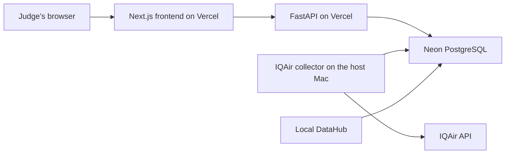

# AirTrace deployment guide

AirTrace uses two Vercel projects from the same GitHub repository:

- `airtrace-api` runs the Python FastAPI application.
- `airtrace-frontend` runs the Next.js dashboard.

Both use the hosted Neon PostgreSQL database. Open-source DataHub remains on a
teammate's Mac during the hackathon demo and catalogs that same database.

## Architecture


```mermaid
flowchart LR
    J["Judge's browser"] --> F["Next.js frontend on Vercel"]
    F --> A["FastAPI on Vercel"]
    A --> P["Neon PostgreSQL"]
    C["IQAir collector on the host Mac"] --> I["IQAir API"]
    C --> P
    D["Local DataHub"] --> P
```

The frontend never receives the PostgreSQL password or IQAir API key. It reads
data through the FastAPI application.

## What is deployed

| Component | Location | Purpose |
|---|---|---|
| Next.js frontend | Vercel | Public dashboard for judges |
| FastAPI | Vercel | Reads observations from PostgreSQL |
| PostgreSQL | Neon | Persistent observation storage |
| IQAir collector | Host Mac | Fetches and stores a new observation |
| DataHub | Host Mac | Catalogs PostgreSQL metadata and profiling |

The current FastAPI endpoints read existing rows. They do not make a new IQAir
request. Run `main.py` when you want to collect another observation.

## Before deploying

### 1. Install the local Python environment

DataHub is an optional local dependency so Vercel does not install it with the
web API:

```bash
uv sync --extra datahub
```

The project remains pinned to Python 3.11 through `.python-version` and
`pyproject.toml`.

### 2. Install the frontend environment

```bash
cd frontend
npm install
cd ..
```

### 3. Prepare local environment variables

If `.env` does not exist:

```bash
cp .env.example .env
```

Fill in:

```text
IQAIR_API_KEY=...
TOMTOM_API_KEY=...
DATABASE_URL=...
DATAHUB_POSTGRES_HOST=...
FRONTEND_URL=http://localhost:3000
```

Use Neon's pooled connection string for `DATABASE_URL` when possible. Its
hostname normally contains `-pooler`.

### 4. Verify locally

Terminal 1:

```bash
uv run uvicorn api:app --reload --port 8000
```

Terminal 2:

```bash
cd frontend
npm run dev
```

Check:

```text
http://localhost:8000/api/health
http://localhost:8000/api/observations
http://localhost:3000
```

### 5. Push the repository to GitHub

Vercel must be able to read the repository. Do not commit `.env`; configure its
values in the Vercel dashboard instead.

## Deploy the Python API

1. In Vercel, choose **Add New → Project**.
2. Import this GitHub repository.
3. Name the project `airtrace-api`.
4. Leave the root directory at the repository root (`.`).
5. Let Vercel detect the Python/FastAPI project.
6. Do not add a custom build command.
7. Add these environment variables:

```text
DATABASE_URL=your pooled Neon connection string
FRONTEND_URL=http://localhost:3000
```

`FRONTEND_URL` is temporary during the first deployment because the final
frontend address does not exist yet.

Deploy and copy the resulting address, for example:

```text
https://airtrace-api.vercel.app
```

Verify both endpoints:

```text
https://airtrace-api.vercel.app/api/health
https://airtrace-api.vercel.app/api/observations
```

The health response should contain:

```json
{
  "status": "ok",
  "database": "PostgreSQL",
  "database_connected": true
}
```

## Deploy the frontend

1. In Vercel, add another project from the same GitHub repository.
2. Name it `airtrace-frontend`.
3. Set its root directory to `frontend`.
4. Let Vercel detect Next.js.
5. Add this environment variable using the real API address:

```text
NEXT_PUBLIC_API_URL=https://airtrace-api.vercel.app
```

Deploy and copy the resulting frontend address, for example:

```text
https://airtrace-frontend.vercel.app
```

## Finish the API CORS setting

Return to the `airtrace-api` Vercel project and replace `FRONTEND_URL` with the
real frontend origin:

```text
FRONTEND_URL=https://airtrace-frontend.vercel.app
```

Redeploy the API. Then refresh the frontend. Its status should say
**Reading PostgreSQL** rather than **Demo data**.

## Run DataHub for the demo

DataHub is not deployed to Vercel. It runs locally and reads the same Neon
database as the deployed API.

Start DataHub:

```bash
uv run datahub docker quickstart
```

Publish the PostgreSQL metadata:

```bash
uv run --env-file .env datahub ingest -c ingestion/postgres.yml
```

Open the local DataHub UI:

```text
http://localhost:9002
```

Ingestion does not need to run after every IQAir observation. Run it again when
the table schema, documentation, lineage, or profiling information changes.

## Collect fresh IQAir data

From the project root on the host Mac:

```bash
uv run python main.py
```

The command calls IQAir once and writes the observation to Neon. The deployed
frontend can then read it through the deployed API by pressing **Refresh data**.

## Collect traffic context

From the project root on the host Mac:

```bash
uv run python collect_traffic.py
```

The collector calls TomTom Traffic Flow at one representative major-road point
per pilot district and stores the current and free-flow speeds in Neon. Add
`TOMTOM_API_KEY` to the host's `.env`; never add it to the frontend or commit it.
Run DataHub ingestion again after the first collection so it catalogs the new
`traffic_observations` table.

## Enable Gemini district reports

Add these secrets to the API environment (and to the local `.env` for local
development):

```text
GEMINI_API_KEY=your_server_side_key
GEMINI_MODEL=gemini-3.1-flash-lite
DATAHUB_GMS_URL=http://localhost:8080
DATAHUB_GMS_TOKEN=your_datahub_personal_access_token
DATAHUB_MCP_WRITE_ENABLED=true
```

The frontend calls `POST /api/investigate` after the user sends a district
inspection prompt. Gemini chooses from a backend allowlist of tools. The backend
uses DataHub MCP to verify the live schemas and source contracts for CAMS, IQAir,
weather, and TomTom, retrieves bounded Neon evidence/history, and runs a
transparent source-hypothesis assessment. Gemini selects relevant fact IDs, while
the backend supplies the actual values and source labels. The API saves the report,
tool evidence, and a human-review action to Neon. When
`DATAHUB_MCP_WRITE_ENABLED=true`, it also writes a concise investigation document
to DataHub through DataHub's REST API. The browser never receives the Gemini key,
DataHub token, or direct database access.

For local open-source DataHub, start DataHub first and create a personal access
token in its UI. Keep the GMS token in `.env`; do not commit it. The official
self-hosted MCP server uses `DATAHUB_GMS_URL` and `DATAHUB_GMS_TOKEN`. Open the
browser interface at `http://localhost:9002`; `http://localhost:8080` is the GMS
API and is not intended to be opened as a website.

## Collect weather and wind context

From the project root on the host Mac:

```bash
uv run python collect_weather.py
```

The command reads current modeled weather from Open-Meteo for Hanoi and saves
wind speed and direction, gusts, temperature, humidity, precipitation, and a
weather code to Neon. It does not require an API key.

## Collect modeled pollutant context

From the project root on the host Mac:

```bash
uv run python collect_air_quality.py
```

The command saves Open-Meteo's CAMS-modelled PM2.5, PM10, NO₂, SO₂, CO, and O₃
concentrations to Neon for the eight Hanoi pilot districts. These are regional
model estimates, not sensor readings.

## Deployment checklist

- [ ] API `/api/health` reports a PostgreSQL connection.
- [ ] API `/api/observations` returns at least one observation.
- [ ] API `/api/weather` returns at least one weather observation.
- [ ] API `/api/modeled-air-quality` returns at least one modeled air-quality observation.
- [ ] Frontend has `NEXT_PUBLIC_API_URL` set to the deployed API.
- [ ] API has `FRONTEND_URL` set to the deployed frontend origin.
- [ ] Frontend says **Reading PostgreSQL**.
- [ ] `.env` and API keys are not committed.
- [ ] Local DataHub shows the PostgreSQL dataset.
- [ ] `DATAHUB_GMS_URL` and `DATAHUB_GMS_TOKEN` are set for the agent's MCP connection.
- [ ] A district inspection creates an `awaiting_human_review` Neon record.
- [ ] `main.py` can add a new IQAir observation.

## Common problems

### The frontend says Demo data

Check these in order:

1. Open the deployed API `/api/observations` URL directly.
2. Confirm `NEXT_PUBLIC_API_URL` has no trailing `/api` path.
3. Confirm `FRONTEND_URL` exactly matches the frontend origin.
4. Redeploy each project after changing an environment variable.
5. Confirm PostgreSQL contains at least one row.

### The API health response reports an error

Confirm the API project's `DATABASE_URL` is the complete Neon PostgreSQL
connection string and includes the required SSL settings.

### DataHub does not show the newest row

DataHub catalogs and profiles the table; it is not the application's row
browser. Inspect rows through the API or run:

```bash
uv run python scripts/inspect_database.py
```

### A Vercel preview deployment is blocked by CORS

The API currently allows one exact frontend origin. Use the production frontend
URL for judging. Support for multiple preview origins can be added later.

## Agent safety boundary

AirTrace never gives Gemini database credentials or arbitrary SQL access. Gemini
can only request the backend's allowlisted tools for the selected district. Its
only automated action is to create an investigation marked
`awaiting_human_review`; public alerts and operational actions require a human.
