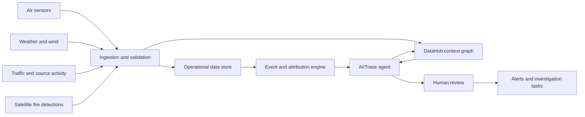

# AirTrace Vietnam

A near-real-time AI agent that investigates poor air quality in Hanoi, ranks its likely sources, and coordinates an evidence-backed response using DataHub.

## Problem statement

Air-quality readings can tell Hanoi residents that pollution is dangerous, but they do not always explain where it came from or what action should follow. Relevant evidence—monitor readings, sensor health, wind, weather, traffic, fire hotspots, and nearby activities—comes from different systems and updates at different times. A spike may represent traffic, biomass burning, regional transport, or simply a faulty sensor.

Schools, environmental teams, and local authorities need an auditable way to validate an event, identify its most likely cause, protect affected people, and request targeted verification.

**How might we turn fragmented environmental data into timely, source-aware air-quality actions for Hanoi?**

## The agent's job

AirTrace does more than display AQI:

1. Detect an unusual or unhealthy pollution event.
2. Verify that the readings are fresh and supported by nearby sensors.
3. Retrieve wind, weather, traffic, fire, and location context.
4. Rank possible sources and show the evidence for each hypothesis.
5. Propose a source-specific protective or investigation action.
6. Require human approval for consequential actions.
7. Execute the approved notification or inspection request.
8. Write the investigation and outcome back to DataHub.

AirTrace reports a **likely source with confidence**, not definitive scientific attribution.

## MVP source hypotheses

The hackathon version distinguishes three scenarios:

- **Traffic:** multiple roadside sensors rise during a traffic peak, with supporting NO2 and weather evidence.
- **Biomass or open burning:** PM2.5 rises while an active fire is located upwind.
- **Faulty sensor:** one sensor spikes while nearby sensors disagree or its data is stale or unhealthy.

Industrial, construction, and long-range pollution attribution can be added after the MVP.

## Draft system design



The operational store contains measurements and model outputs. DataHub contains their context: schemas, units, lineage, owners, freshness, quality status, and previous investigations.

### Components

- **Collectors:** scheduled Python jobs that poll data sources every 5–15 minutes where supported.
- **Operational store:** DuckDB for the demo; PostgreSQL/PostGIS later.
- **DataHub:** catalogs sources and outputs, tracks lineage and quality, and stores investigation records.
- **Event detector:** deterministic thresholds and anomaly rules.
- **Attribution engine:** scores source hypotheses from spatial, temporal, wind, pollutant, and activity evidence.
- **AI agent:** gathers DataHub context, explains the evidence, selects an allowed action, and records the result.
- **Web interface:** map, timeline, hypothesis ranking, evidence panel, and approval control.
- **Action adapter:** one test notification channel and one inspection-task destination.

## Web application

AirTrace will be delivered as an operations web app. It is not only an air-quality map: it is the interface for observing events, reviewing the agent's evidence, approving actions, and learning from previous investigations.

### Core screens

1. **Live map** — air sensors, PM2.5 levels, wind, fire hotspots, roads, schools, hospitals, and active investigation areas.
2. **Event timeline** — a timestamped view of detection, data validation, evidence collection, hypothesis updates, and actions.
3. **Source investigation** — ranked source hypotheses with confidence plus supporting and contradicting evidence.
4. **Action panel** — approve, reject, or modify school notifications, sensor checks, inspection requests, and escalations.
5. **Investigation history** — previous events, conclusions, actions, and outcomes retrieved from DataHub.

Example source ranking:

| Possible source | Confidence | Main evidence |
|---|---:|---|
| Biomass burning | 74% | Recent fire detection located upwind |
| Traffic | 19% | Moderate congestion but weak NO2 increase |
| Faulty sensor | 7% | Nearby sensors confirm the event |

### Application boundary

```text
Browser
   ↓
AirTrace web application
   ↓
AirTrace API and agent
   ├── Environmental data collectors
   ├── Event and attribution engine
   ├── DataHub MCP or Agent Context Kit
   └── Notification and task adapters
```

The browser does not connect directly to DataHub or external data feeds. The backend protects credentials, normalizes source data, runs attribution, invokes the agent, and executes approved actions.

### Draft technology choices

- **Frontend:** Next.js with MapLibre or Leaflet
- **Backend:** Python with FastAPI
- **Demo database:** DuckDB
- **Map tiles and locations:** OpenStreetMap
- **Live experience:** backend polling plus browser updates every 10–30 seconds during the demo
- **Agent context:** DataHub MCP Server or Agent Context Kit
- **Judging deployment:** Vercel-hosted frontend and Python API functions

The hackathon demo can replay timestamped observations as a live event while using the same interfaces intended for real near-real-time feeds.

### Judging deployment target

The public judging demo will be deployed on Vercel. Architecture and dependency choices must therefore remain compatible with Vercel's frontend and Python function runtimes.

The project is currently pinned to Python 3.11 for local development. Vercel's Python runtime currently supports Python 3.12, 3.13, and 3.14, so the project must move to a supported version and revalidate its dependencies before deployment.

DuckDB remains the local development and replay database. Vercel Functions do not provide a persistent writable filesystem, so a deployed workflow that collects or modifies data must use an external persistent database or object store. API keys and other credentials will be configured through Vercel environment variables rather than deployed `.env` files.

DataHub is a separate service and must be reachable from the Vercel deployment. The local DataHub quickstart supports development, while the judging deployment will require a hosted DataHub endpoint or another publicly reachable deployment.

### Planned local command interface

AirTrace will expose separate commands for setup, collection, inspection, and metadata synchronization instead of running DataHub ingestion every time the application starts:

```bash
uv run airtrace setup
uv run airtrace collect
uv run airtrace inspect
uv run airtrace sync-datahub
```

- `setup` creates the empty database schema without requiring an IQAir request, verifies that DataHub is reachable, and publishes the initial table metadata.
- `collect` requests one current observation from IQAir and saves it. Collection must continue to work when DataHub is unavailable.
- `inspect` displays the local database tables, schema, and recent observations.
- `sync-datahub` republishes metadata after database schema, lineage, or documentation changes. It does not need to run after every new observation.

The planned first-run workflow is:

```bash
uv sync
cp .env.example .env
uv run datahub docker quickstart
uv run airtrace setup
uv run airtrace collect
```

This command interface is not implemented yet. The current prototype uses `uv run python main.py` for collection and `uv run datahub ingest -c ingestion/duckdb.yml` for metadata ingestion.

### Run the dashboard prototype

The browser cannot read a DuckDB file directly, so the project now includes a
small Python API in `api.py`. Use two terminal windows:

**Terminal 1 — start the Python API from the main project folder:**

```bash
uv run uvicorn api:app --reload --port 8000
```

**Terminal 2 — start the frontend:**

```bash
cd frontend
npm install
npm run dev
```

Then open <http://localhost:3000>. The dashboard says **Reading DuckDB** when
the API returned stored observations. If the API is unavailable or the database
is empty, it says **Demo data** and uses the clearly labeled values in
`frontend/app/mock-data.ts`.

The API only reads the database. Run `uv run python main.py` separately whenever
you want to collect and save a new IQAir observation.

## Data required

| Dataset | Minimum fields | Purpose |
|---|---|---|
| Air-quality observations | sensor ID, time, PM2.5, PM10, NO2, SO2, CO, O3 | Detect events and pollutant patterns |
| Sensor registry | sensor ID, coordinates, operator, calibration, status | Assess trust and spatial agreement |
| Weather | time, location, wind speed/direction, humidity, rain | Estimate transport conditions |
| Traffic | road segment, time, congestion or vehicle count | Test the traffic hypothesis |
| Active fires | coordinates, detection time, confidence | Test the burning hypothesis |
| Hanoi boundaries and roads | district/ward geometry, road network | Explain affected areas and nearby sources |
| Sensitive locations | schools and hospitals with coordinates | Prioritize protective actions |
| Historical events | measurements, hypothesis, outcome | Compare patterns and evaluate the agent |

Potential starting sources:

- [Hanoi environmental monitoring portal](https://airhanoi.hanoi.gov.vn/)
- [OpenAQ API](https://docs.openaq.org/)
- [NASA FIRMS active-fire data](https://firms.modaps.eosdis.nasa.gov/active_fire/)
- [Copernicus Atmosphere Monitoring Service](https://www.copernicus.eu/en/copernicus-services/atmosphere)
- OpenStreetMap for roads and public locations

Every source must be checked for availability, reuse terms, update frequency, spatial coverage, and historical access before inclusion. Missing feeds will be replaced with documented synthetic data for the demo.

## Attribution approach

The MVP uses transparent evidence scoring rather than an opaque prediction model:

```text
hypothesis score =
    spatial agreement
  + wind alignment
  + pollutant signature
  + known source activity
  + historical similarity
  - stale, missing, or unhealthy evidence
```

Each conclusion includes:

- Ranked hypotheses
- Confidence and uncertainty
- Evidence supporting and contradicting each hypothesis
- Data timestamps and freshness
- Recommended next action

## Actions

Depending on the evidence, AirTrace can:

- Recommend that selected schools pause outdoor activities.
- Send targeted health guidance for an affected district.
- Request manual verification of a questionable sensor.
- Create an inspection task for suspected local burning.
- Escalate an unexplained event to an environmental team.
- Withhold an alert when the evidence is stale or contradictory.

Public alerts, accusations, or regulatory actions are outside the autonomous MVP and always require human review.

## Why DataHub

DataHub allows the agent to determine:

- Which system and organization produced each measurement
- Whether a source is fresh, healthy, and correctly calibrated
- What units and transformations were applied
- Which analysis and alert depends on which input
- Who owns a failed source or pipeline
- What evidence and decisions were recorded in earlier events

Without this context, the agent may treat stale or incompatible measurements as trustworthy. After each investigation, AirTrace saves its evidence, decision, action, and outcome so future investigations inherit that knowledge.

## Demo scenarios

1. **Traffic event:** a coordinated morning increase near major roads leads to a school-protection recommendation.
2. **Upwind fire:** PM2.5 rises alongside a recent NASA fire detection and supporting wind direction, leading to an investigation request.
3. **False spike:** one unhealthy sensor disagrees with nearby stations, so the agent requests sensor verification instead of issuing a pollution alert.

The demo replays timestamped events as a live stream. Production feeds would be near-real-time because each source has different update latency.

## MVP boundaries

- Hanoi pilot area only
- Three source hypotheses
- Transparent rules and evidence scoring
- Decision support, not regulatory proof
- One notification and one task integration
- Human approval for consequential actions
- Complete evidence and action audit trail

## Open decisions

- Exact Hanoi districts and sensors in the pilot
- Availability and license of historical Hanoi measurements
- Accessible traffic-data source or synthetic traffic generator
- Notification and inspection-task destinations
- Local DataHub OSS versus hosted DataHub
- Vercel-compatible persistent database or object store
- LLM provider

## Hackathon fit

AirTrace targets **Agents That Do Real Work**: it reads organizational and technical context through DataHub, investigates an operational problem, initiates a useful response, and writes the resulting knowledge back for the next person or agent.

Required submission artifacts:

- Public Apache-2.0 repository with reproducible setup
- Working DataHub integration using MCP or Agent Context Kit
- Documented real and synthetic datasets
- Replayable example scenarios
- Public demo or clear local run instructions
- Demo video under three minutes
